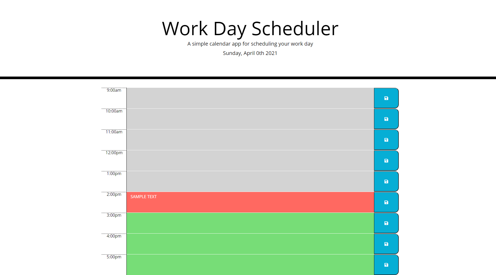

## WORKDAY PLANNER

### OVERVIEW
In this challenege I was tasked with suing jQuery, Bootstrap, a textAPI, and moment.js to build a daily workday planner. It includes the use of localStorage to keep and display items set by the user within the textarea. The most challenging part was figuring out how to set the class of each textarea based upon real world time! Thank goodness for StackOverflow.

### LINK TO GITHUB
Click **[HERE](https://github.com/adamlsn/workday)**

### LINK TO LIVE APPLICATION
Click **[HERE](https://adamlsn.github.io/workday/)**

### SCREENSHOT
